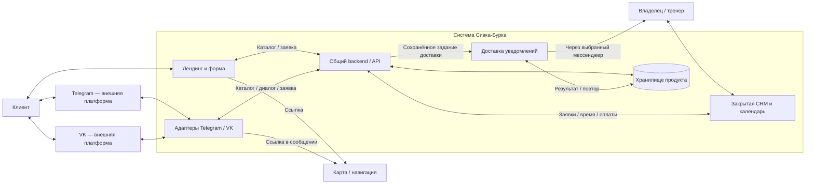

# Контекст системы и границы ответственности

Status: ACCEPTED
Задача: ARCH-002. Версия: 1.0. Дата: 2026-09-13.
Основание: [требования ARCH-001](requirements.md), принятые ADR-001/002.
Это проект целевой системы MVP, а не описание уже работающего продукта.

## 1. Назначение и граница MVP

Система заранее информирует клиента и принимает заявку через лендинг, Telegram-бот
или VK-бот. Владелец получает уведомление, лично согласует услугу и время, ведёт
запись, оплаты и завершение в CRM. Она не продаёт свободный слот автоматически и
не принимает решение о допуске человека к услуге.

Внутри продукта: публичный лендинг, два адаптера ботов, общий прикладной backend/API,
закрытый интерфейс CRM, хранение заявок/каталога/истории и подсистема уведомлений.
Это логические части одного приложения: отдельные микросервисы и брокер сообщений
из данной схемы не следуют. Начальный вариант — один backend с разделёнными модулями.
Фреймворки, транспорт событий и схема базы здесь не выбираются.

## 2. Участники и внешние системы

| Участник/система | Ответственность вне нашего приложения | Взаимодействие |
| --- | --- | --- |
| Клиент | Выбирает интересующую услугу, сообщает пожелания и контакт | Браузер или интерфейс мессенджера |
| Владелец/тренер | Допуск, окончательное время, цена по договорённости, подтверждение денег | CRM; получает уведомления; лично связывается с клиентом |
| Telegram | Внешний канал обмена сообщениями | Адаптер Telegram-бота; возможный канал уведомления владельца |
| VK | Внешний канал обмена сообщениями | Адаптер VK-бота |
| Карта/навигация | Отображает расположение и маршрут | В MVP достаточно утверждённой ссылки; встроенный виджет не обязателен |
| Рекламный источник | Приводит посетителя с метками | Нормализованные метки связаны с заявкой; кабинет рекламы не интегрирован |
| Телефон, WhatsApp, личные чаты | Сохраняются как внешние способы общения | Владелец может вручную занести заявку; автоматическое чтение переписки не входит в MVP |
| Банк/способ оплаты | Фактическое движение денег | Вне интеграционной границы; владелец вручную фиксирует полученные суммы |

Telegram для уведомления владельца — предпочтение из требований, а не уже настроенная
интеграция. Получатель и способ подключения определяются в ARCH-007 и перед запуском.
Отдельные учётные записи тренеров, клиентский личный кабинет и внешняя CRM не требуются.

## 3. Схема контекста

Стрелка доставки владельцу проходит через внешний канал, выбираемый в ARCH-007;
прямое соединение backend с устройством владельца не предполагается.

## 4. Ответственность внутренних частей

| Часть | Владеет поведением | Не является её полномочием |
| --- | --- | --- |
| Лендинг | Показ каталога, правил и карты, ввод заявки, понятный результат отправки | Подтверждение записи, получение денег, доступ к CRM |
| Адаптер Telegram | Перевод диалога/событий Telegram в общий сценарий заявки и ответы | Своя независимая цена, статусы или правила допуска |
| Адаптер VK | То же для VK; различия интерфейса остаются в адаптере | Копирование бизнес-правил Telegram как отдельного домена |
| Общий backend | Проверка входа и прав, команды заявки, каталог, расчёт учётных сумм, история, состояние доставки | Самостоятельный допуск, автоматическая оплата, решение спорных бизнес-условий |
| CRM | Работа владельца с карточками и календарём, ввод фактических оплат/статусов | Обход серверных прав и валидации; собственная копия записей |
| Хранилище | Состояние продукта, согласованные цены/время, история и задания доставки | Публичный доступ из браузера или мессенджера |
| Подсистема доставки | Отправка уведомления, учёт ошибки и повторов | Создание новой заявки при повторе уведомления |

В монорепозитории это соответствует apps/web, apps/bot, apps/api и apps/admin.
apps/bot содержит два адаптера; это не решение запускать два отдельных сервиса.
packages/contracts хранит общие контракты после ARCH-005. Планируемая СУБД из bootstrap —
PostgreSQL; таблицы, миграции и схема владения данными относятся к ARCH-006.

## 5. Единые источники данных

- Каталог, цены, правила и местоположение берутся из одного управляемого источника;
  каналы могут по-разному отображать сведения, но не самостоятельно менять их смысл.
- Заявка, согласованное время и ручные отметки денег хранятся в backend/базе.
  Календарь CRM — представление этих записей, не отдельная система бронирования.
- Желаемая дата/время клиента отделены от согласованных владельцем. Заявка без
  подтверждённой даты остаётся в списке; пожелание само не резервирует ресурс.
- Финансовая отметка означает ручное подтверждение владельцем, не банковскую сверку.
  Статусы услуги и оплаты не сливаются в одно поле; структуру определяет ARCH-003/004.
- Историческая согласованная стоимость сохраняется независимо от последующих цен каталога.
- Идентичность мессенджера включает канал: числовой ID Telegram не равен ID VK.
  Обращения разных каналов нельзя автоматически объединять только по имени.
- Источник рекламы отделён от канала приёма: клиент мог прийти из рекламы на сайт,
  а заявку завершить в боте. Отсутствие метки не мешает создать заявку.

## 6. Основные взаимодействия

### 6.1 Лендинг

Клиент читает информацию → выбирает услугу и желаемое время → сообщает контакт →
backend валидирует и сохраняет заявку → возвращает подтверждение приёма →
владелец видит заявку в CRM и получает уведомление.
Подтверждение приёма не означает, что время, допуск или оплата подтверждены.
Время для пользователя отображается в явно указанном часовом поясе клуба; настройка
не наследуется молча от компьютера разработчика. Значение фиксируется перед реализацией календаря.

### 6.2 Telegram и VK

Адаптер ведёт ограниченный сценарий: информация → услуга → пожелания/контакт →
подтверждение отправки. Оба вызывают одну прикладную операцию backend.
Частично заполненный диалог не становится подтверждённой записью.
Состояние незавершённого диалога, его срок хранения и возобновление детализируются
в ARCH-003/005; не обещается автоматический перенос диалога между Telegram и VK.

Для ботов не требуется LLM: каталог, правила и сценарии определяются явно.
Локальная модель служит разработке, а не обработке разговоров клиентов в production.
Свободные вопросы за пределами сценария направляются к владельцу без выдуманного ответа.

### 6.3 Работа владельца

Владелец авторизуется → открывает заявку → связывается с клиентом вне автоматического
согласования → вводит окончательные условия/время → отмечает полученные суммы →
после услуги отмечает завершение. Перенос, отмена, ожидание предоплаты и исправления
детализируются в ARCH-004; автоматической политики возвратов здесь нет.
Напоминания клиенту и сообщения об изменении статуса не добавляются автоматически:
пока подтверждено уведомление владельца о новой заявке.

### 6.4 Доставка и сбои

Создание заявки и обязательства уведомить владельца должны сохраняться согласованно.
Предпочтительный простой механизм для ARCH-006/007 — запись задания доставки рядом
с заявкой в одной транзакции и последующая фоновая отправка. Отдельный брокер не нужен.

| Ситуация | Поведение на границе системы |
| --- | --- |
| Хранилище не приняло заявку | Нет ложного сообщения об успешном сохранении; клиент может повторить |
| Ответ потерялся после сохранения | Повтор той же операции возвращает прежний результат, не создавая дубль |
| Повтор входящего события мессенджера | Повторная обработка не создаёт вторую заявку |
| Новая отдельная заявка от прежнего клиента | Допускается; защита от дублей не блокирует все обращения человека |
| Мессенджер уведомлений недоступен | Сохранённая заявка доступна в CRM, доставка ожидает повтора/внимания владельца |
| Неизвестная метка рекламы или ошибка аналитики | Заявка принимается независимо от атрибуции |
| Одновременное редактирование в двух вкладках CRM | Устаревшая запись не должна незаметно перезаписать новую; механизм в ARCH-005 |

Подтверждение доставки в API мессенджера не равно прочтению владельцем. При неопределённом
результате внешней отправки возможен повтор уведомления; exactly-once доставка человеку
не обещается. Защита от дубля заявки и защита от дубля уведомления — разные задачи.

## 7. Границы доверия и права

| Граница | Правило |
| --- | --- |
| Публичный браузер → backend | Все поля недоверенные; разрешено только ограниченное чтение каталога и создание заявки; клиент не назначает цену, оплату или служебный статус |
| Внешняя платформа → адаптер | Проверяется подлинность/принадлежность входящего события доступным механизму канала способом; переданный в payload ID сам по себе не даёт полномочий |
| Адаптер → прикладной слой | Нормализованные сообщения и явная идентичность канала; произвольные команды из текста клиента не исполняются |
| Владелец → CRM API | Каждая закрытая операция проверяет авторизацию сервером; скрытая кнопка в UI не является защитой |
| Backend → база | Только серверный доступ; credentials отсутствуют во frontend и сообщениях бота |
| Сервис → внешняя доставка | Секреты хранятся вне Git; адресат уведомлений задаётся доверенной конфигурацией, не полем клиентской формы |
| Клиентский текст/метки → UI и логи | Ограничение размера, безопасный вывод, фильтрация полей атрибуции; контакты и секреты не копируются в общие диагностические логи |

Публичные запросы ограничиваются от злоупотребления; конкретные лимиты и механизм
входа владельца определяются при проектировании API/auth. Возраст, вес и опыт не
используются как отказ в отправке заявки. Это не ослабляет техническую валидацию полей.
В уведомлении предпочтительны краткая информация и закрытая ссылка на карточку;
точный состав данных и адресат будут определены в ARCH-007.

## 8. Что остаётся за границей

Владелец принимает решения об участии, согласует загрузку, получает деньги и подтверждает
факт услуги. Система не распределяет лошадей автоматически, не интегрируется с банком,
не собирает все личные переписки и не подтверждает заявки по скриншоту оплаты.
Карта открывается по ссылке; выбор провайдера не влияет на сохранение заявки.
Рекламные пиксели/кабинеты, сторонняя передача контактов и сложная аналитика требуют
отдельного решения. Перспектива других тренеров не означает готовую многопользовательскую CRM.

## 9. Проверка интеграций перед реализацией

Эта задача не проверяла реальные API Telegram/VK, аккаунты, права ботов или доступность
хостинга. Способ получения событий, требования подтверждения отправителя, ограничения
диалогов, payload при переходе сайт → бот и ответы на повторы проверяются по актуальной
официальной документации и коротким интеграционным проверкам перед написанием адаптеров.
Конкретные API URL, scopes, SDK и методы не зафиксированы без такой проверки.

| Зависимость | Ответственный этап | Что должно появиться |
| --- | --- | --- |
| Сущности, клиент/участники, заявка, ручные оплаты | ARCH-003 | Домен и инварианты без автоматического допуска |
| Подтверждение, предоплата, отмена, перенос | ARCH-004 + владелец | Однозначные переходы и исключения |
| Команды/DTO, ошибки, авторизация, повторы, конфликт версии | ARCH-005 | Общие контракты для трёх каналов и CRM |
| Хранение, согласованные записи, задания доставки, история | ARCH-006 | Схема и транзакционные границы |
| Канал/адресат, формат, повторы, наблюдаемость доставки | ARCH-007 | Договорённость о доставке без ложных гарантий |
| Домены, аккаунты Telegram/VK, права, адрес/карта, часовой пояс | Подготовка интеграций/пилота | Проверенные настройки и материалы владельца |
| Сервис аналитики и срок хранения | Отдельное решение перед подключением | Утверждённая цель и объём внешней передачи |

Неопределённые операционные настройки не меняют принятую границу MVP. Документ не
разрешает подключать внешние аккаунты, публиковать сайт или выполнять денежные операции.

## 10. Критерии принятия ARCH-002

- Три клиентских входа сходятся в один прикладной процесс; CRM использует те же записи.
- Каталог общий; цены/статусы/оплаты не принадлежат отдельным ботам.
- Владелец остаётся единственным источником подтверждения времени, допуска и ручных оплат.
- Внешние платформы, карта, реклама и фактическая оплата отделены от внутренних функций.
- Права публичного клиента и владельца разделены; определены границы недоверенного ввода.
- Сохранение заявки, повтор операции и доставка уведомления разделены; сбои описаны.
- Детали следующих ARCH-задач и непроверенные интеграции явно перечислены.

Трассировка: разделы 2–6 покрывают FR-01–10; общий источник/история/повторы — FR-12–15;
ручной ввод для внешних обращений остаётся детализацией предложения FR-11 из ARCH-001.
Новые услуги, бизнес-статусы или правила предоплаты этим документом не вводятся.
