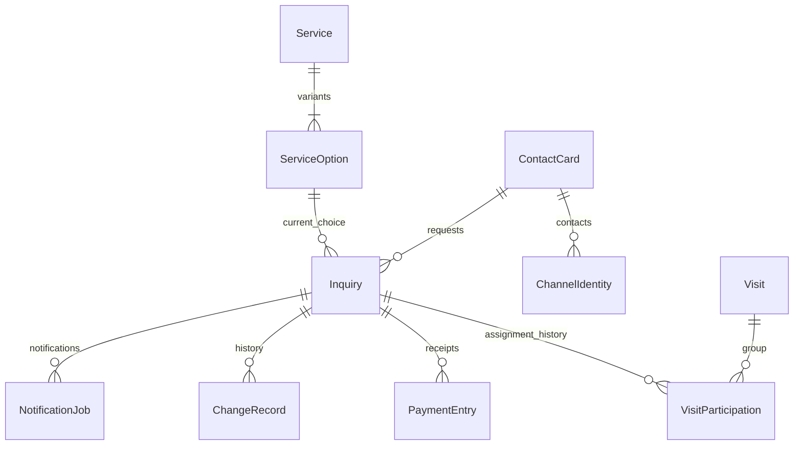

# Доменная модель MVP «Сивка-Бурка»

Status: ACCEPTED
Задача: ARCH-003. Версия: 1.0. Дата: 2026-09-13.
Основание: [требования](requirements.md), [контекст системы](architecture.md).
Описаны понятия, связи и инварианты. Это не SQL-схема и не готовые API-контракты.

## 1. Словарь

| Понятие | Значение |
| --- | --- |
| Услуга | Вид предложения клуба: например, групповая прогулка или обучение |
| Вариант услуги | Конкретная длительность и правило цены: 30/60 минут либо по согласованию |
| Заявитель | Контактное лицо, которое оставило заявку; не обязательно сам участник |
| Участники заявки | Люди, для которых запрошена услуга; в MVP достаточно количества и необходимых заметок |
| Заявка | Намерение клиента и дальнейшее согласование; сохраняет свой ID на всём пути |
| Согласованное посещение | План оказания услуги в определённое время, отображаемый в календаре |
| Согласованные условия | Услуга, длительность, количество участников, итоговая стоимость и договорённости конкретной заявки |
| Отметка оплаты | Ручная запись владельца о фактически полученных деньгах; не банковская транзакция |
| Ожидаемая предоплата | Договорённость, сколько нужно получить заранее; не факт получения денег |
| Канал | Где принята заявка: лендинг, Telegram, VK или ручной ввод владельца |
| Источник привлечения | Откуда пришёл клиент: рекламная кампания, прямая ссылка, неизвестно и т. п. |

Термин «заказ» в разговоре владельца соответствует той же заявке после согласования;
отдельная копия заказа с новым ID при подтверждении не создаётся.
Допуск к услуге остаётся личным решением владельца/тренера и не выводится из веса,
возраста, опыта, размера оплаты или выбранного тарифа.

## 2. Каталог

### Service — услуга

Стабильный идентификатор, название, описание, информационные правила, признак доступности
для новых обращений. Каталог общий для лендинга и двух ботов.
Скрытие услуги из продажи не удаляет исторические заявки на неё.

### ServiceOption — вариант

Принадлежит одной услуге. Содержит длительность в минутах либо «по согласованию»,
модель цены FIXED_PER_PERSON или NEGOTIATED и актуальную сумму для фиксированного варианта.
Для NEGOTIATED сумма неизвестна до согласования: null, а не 0.
Суммы хранятся точно, в целых копейках RUB; двоичная плавающая точка не используется.
Ноль — конкретное денежное значение, не подстановка для отсутствующей цены.
Правило допустимости бесплатной услуги здесь не вводится; при необходимости его
нужно отдельно согласовать с владельцем до реализации соответствующего сценария.

| Услуга | Варианты и цены за человека |
| --- | --- |
| Групповая прогулка | 60 минут — 3500 ₽; 30 минут — 2000 ₽ |
| Индивидуальная прогулка | 60 минут — 5000 ₽; 30 минут — 3500 ₽ |
| Активная прогулка, галоп | 60 минут — 5000 ₽; 30 минут — 3500 ₽ |
| Катание ребёнка в поводу | 15 минут — 1000 ₽ |
| Обучение верховой езде | 60 минут — 3500 ₽ |
| Фотосессия, аренда лошади | Длительность и цена по согласованию |
| Экскурсия по конюшне | Длительность и цена по согласованию |

Коды S-01–S-10 из требований соответствуют десяти вариантам семи услуг. Это не десять
несвязанных товаров и не будущие UUID базы. Полчаса не рассчитывается как половина часа:
используется собственный вариант прайса. Входит ли инструктаж в длительность, определяет
владелец позже; автоматически добавлять или вычитать время пока нельзя.

## 3. Контакт и участники

### ContactCard — контакт заявителя

Имя/обращение и способы связи, доступные владельцу. Это запись CRM, а не аккаунт клиента.
Регистрация клиента не требуется. Один контакт может иметь несколько заявок.
При сомнении допускаются отдельные карточки вместо ошибочного автоматического объединения.

### ChannelIdentity — идентичность канала

Комбинация платформы, области аккаунта/бота и внешнего идентификатора. Чат/диалог для ответа
и идентификатор человека могут различаться; адаптер не должен считать их одним полем.
Совпадение имён, телефона в свободном тексте или числовых ID разных платформ не доказывает,
что это один человек. Backend получает сведения о канале только из проверенного контекста
адаптера. Публичная форма не может присвоить себе произвольную Telegram/VK-идентичность.
Правила связывания карточек и исправления ошибочных связей относятся к ARCH-005/006;
автоматическое межканальное слияние в MVP не требуется.

В заявке сохраняется контактный снимок на момент обращения: исправление текущей карточки
не переписывает историю первоначального контакта. Точный состав полей уточняется в API.

### PartyDetails — состав участников заявки

Положительное целое количество участников и необязательные пояснения, например «двое
взрослых и ребёнок». Заявитель может записать другого человека или семью.
Полные персональные анкеты всех участников, обязательный ввод точного веса, даты рождения
и медицинских данных не вводятся. Ответ об опыте может быть неизвестен и не является допуском.
Отсутствие подтверждённого допуска не мешает принять заявку для общения с владельцем.

## 4. Заявка и согласование

### Inquiry — заявка

Основной объект CRM: ID, время поступления, контакт, выбранная услуга/вариант,
количество участников, пожелания по времени, источник, статус обработки, заметки владельца.
Сохраняется после подтверждённой отправки клиентом, а не при каждом шаге диалога.
Для первой формы выбран один основной вариант услуги; составные просьбы можно оставить
в комментарии. Корзина нескольких услуг и пакетное бронирование не добавляются автоматически.

Пожелание по времени — отдельное значение RequestedTime: дата, понятное клиентское
пожелание/интервал и контекст часового пояса. Оно не занимает место в расписании.
Неопределённое пожелание нельзя превращать в выдуманное точное время.

### AgreedTerms — согласованные условия заявки

Выбранный владельцем вариант, количество участников, длительность, итоговая цена RUB,
ожидаемая предоплата и пояснения. До согласования отдельные значения могут быть неизвестны.
Снимок исходного выбора/прайса сохраняется отдельно от актуальных согласованных условий.
Пример: двое на групповую прогулку 60 минут → ориентир 2 × 3500 = 7000 ₽;
владелец подтверждает итог или явно меняет его с записью причины.
Публичный клиент может передать выбор, но не подменить доверенную стоимость.

Для согласованной цены сохраняется история изменений. Смена прайса не пересчитывает
старые договорённости. Изменение количества участников после согласования требует
явного пересмотра условий владельцем; уже отмеченные поступления денег не исчезают.
Изменение цены не означает автоматическое списание, возврат или изменение факта оплаты.

Статус обработки заявки и факт оказания услуги/получения денег — различные понятия.
Точные состояния и допустимые переходы будут приняты в ARCH-004. Слова «новая»,
«согласование», «подтверждена» здесь не задают окончательный автомат.

## 5. Посещение и календарь

### Visit — согласованное посещение

Объект календаря: ID, формат услуги, согласованное начало, длительность/окончание,
сведения об изменении времени и связанные заявки. Это план услуги, не ресурсный слот для продажи.
У одного посещения не может быть двух разных актуальных времён в разных клиентских каналах.
Желаемое время заявки не меняется при переносе согласованного посещения без явного
исправления самого пожелания: сохраняется различие между просьбой и договорённостью.

Посещение появляется по явному действию владельца, когда есть достаточные данные для
календаря. Неизвестная длительность фотосессии не подставляется как 60 минут; её нужно
согласовать либо явно отображать как неизвестную, без ложной гарантии окончания.
Часовой пояс клуба — явная настройка. Момент времени, длительность и дата в локальном
календаре не взаимозаменяемы; физическое хранение определяется ARCH-006.

**Подтверждено пользователем:** разные независимые заявки могут относиться к одной
общей групповой прогулке. Поэтому Visit и Inquiry — разные сущности.

### VisitParticipation — участие заявки в посещении

Связывает одну заявку с одной прогулкой и сохраняет историю присоединения, отсоединения
и переноса. Для текущего простого сценария у заявки не более одной актуальной связи;
старые связи сохраняются в истории. У прогулки может быть несколько актуальных связей.
Само членство не меняет финансовые условия заявки и не объединяет контактные карточки.
Владелец явно присоединяет заявки к общей прогулке, проверяя совместимость согласованных
форматов и длительностей. Автогруппировки по совпадению времени/названия услуги нет.
Разные согласованные длительности нельзя молча выровнять или скрыть: владелец должен
согласовать общий план либо разделить посещения. Подробный сценарий относится к ARCH-004.

- Карточка общей прогулки показывает время, число связанных заявок и суммарное количество
  участников; внутри доступны отдельные заявки и их оплаты.
- Итог и поступления принадлежат конкретной заявке, а не общей кассе прогулки.
  Один клиент не считается оплатившим только потому, что оплатил другой участник группы.
- Отмена участия одной заявки не отменяет автоматически остальных. Поведение пустой
  прогулки и статусы участия детализируются в ARCH-004.
- Перенос всей прогулки меняет план для всех актуально связанных заявок; CRM должна
  явно показать владельцу затронутые заявки до изменения.
- Перенос только одной заявки означает изменение её связи с посещением; общее время
  остальных участников не сдвигается незаметно. Цены/оплаты и история заявки сохраняются.
- Общая прогулка не вводит автоматически фиксированную вместимость или подбор лошадей.

Логическая схема связей (не ER-схема физической базы):

Множественность связей VisitParticipation включает историю, но одновременно актуальна
максимум одна связь на заявку. Число людей — сумма participants_count актуальных
участий; число заявок и число людей различаются. Заявки без посещения остаются в CRM.

Календарь читает посещения, список CRM — заявки. Заявка без согласованного посещения
не теряется. Отмена не удаляет историческую дату/связь; видимость и статусы — ARCH-004.
Нагрузка 1–2, редко 6–7 записей в день не является ограничением количества строк или
автоматической вместимостью. Системы Horse/StableCapacity/TrainerShift в MVP не проектируются;
возможность совместить записи проверяет владелец, автоматическая блокировка пересечений
без согласованных ресурсных правил не вводится.

## 6. Ручной учёт денег

### PrepaymentExpectation — ожидаемая предоплата

Значение в согласованных условиях: обычно 50% от согласованного итога, но владелец может
назначить другое. Не вычисляется от неизвестной цены. После изменения цены интерфейс
предлагает владельцу проверить предоплату, а не молча переписывает договорённость.
При нечётном количестве копеек правило округления должно быть единым в API; конкретный
режим фиксируется в ARCH-005 до реализации. Ожидание денег не увеличивает полученную сумму.

### PaymentEntry — отметка фактического поступления

ID, заявка, точная положительная сумма RUB, фактическая дата по вводу владельца,
время регистрации системой, автор и необязательный комментарий.
Может быть несколько поступлений; модель не ограничена ровно двумя платежами.
Предоплата и окончательный расчёт — понятные владельцу назначения записей, а не
внешние банковские статусы. В MVP нет платёжного провайдера или действия «списать деньги».

Ошибочную отметку исправляют с сохранением оригинала, автора и причины: исключение
ошибочной записи из текущего расчёта не равно фактическому возврату денег.
Возврат как отдельное реальное действие и его политика остаются в ARCH-004; нельзя
помечать ошибкой достоверное поступление только ради обнуления баланса после отмены.

Пока цена неизвестна, остаток неизвестен, даже если владелец уже отметил полученную сумму.
Если цена известна, расчётная разница = согласованный итог − сумма действующих поступлений
(учёт реальных возвратов добавляется только после определения соответствующего сценария).
Положительная разница означает остаток, нулевая — расчёт закрыт, отрицательная — превышение
итога/ситуация для внимания владельца. Отрицательную разницу нельзя скрыть через max(0, x).
Из этой арифметики не следует обязательство автоматического возврата или запрет завершить услугу.
Допустимые действия при недоплате/переплате и отмене определяются в ARCH-004.

## 7. История и вспомогательные понятия

| Понятие | Назначение и граница |
| --- | --- |
| ChangeRecord | Кто, когда, какой объект/поля изменил и почему; значимые изменения цены, времени, суммы, статуса и состава участников |
| AcquisitionContext | Канал приёма отдельно от источника/UTM; неизвестные значения допустимы; публичные метки не дают прав |
| ConversationDraft | Незавершённый сценарий одного канала; выбранные ответы, шаг, время обновления; это ещё не заявка |
| SubmissionIdentity | Идентичность одной отправки/входящего события для защиты от повторов; не ID клиента и не глобальный запрет второй заявки |
| NotificationJob | Обязательство уведомить о сохранённой заявке; отдельный ID, событие, адресат, попытки/результат, ссылка на заявку |
| OwnerAccount | Единственный административный субъект MVP; отдельно от клиентских контактов и внешней идентичности бота |

Срок жизни черновика и срок хранения ключей повторов — задачи ARCH-005/006; здесь
не задаётся произвольное число дней. Нельзя создавать заявку после очистки черновика
повтором уже обработанного сообщения без проверки идентичности отправки.
Сбой доставки не отменяет заявку. Повтор задания уведомления не создаёт новую заявку.
История бизнес-изменений не означает полное журналирование переписки, токенов и личных данных.
Сроки хранения/удаления данных определяются отдельно; «сохранить историю» не означает бессрочное хранение.

## 8. Инварианты для реализации

| ID | Инвариант |
| --- | --- |
| INV-01 | Выбранный вариант принадлежит выбранной услуге; исторические ссылки сохраняются при скрытии варианта |
| INV-02 | Цена по договорённости неизвестна до согласования; null не заменяется нулём |
| INV-03 | Каталожная цена, согласованный итог, ожидаемая предоплата и полученные деньги — разные значения |
| INV-04 | Возраст, вес и опыт не вычисляют автоматический допуск и не блокируют подачу заявки |
| INV-05 | Запрошенное время не является согласованным и не резервирует доступность |
| INV-06 | Авторизованный владелец подтверждает/изменяет договорённости; публичный канал не меняет служебные состояния |
| INV-07 | Изменение прайса/условий не удаляет фактические поступления и историю предыдущих условий |
| INV-08 | Контакт заявителя не равен участнику; число участников не требует создания такого же числа клиентских аккаунтов |
| INV-09 | Повтор одной отправки обрабатывается идемпотентно; отдельная новая заявка того же человека допустима |
| INV-10 | Поступления/исправления имеют автора и время; цена неизвестна → остаток неизвестен; превышение цены видно |
| INV-11 | Состояние доставки уведомления не определяет состояние заявки или прочтение сообщения владельцем |
| INV-12 | Конкурентное изменение не должно молча затирать более свежие условия; версия/проверка согласованности — ARCH-005/006 |
| INV-13 | Одна общая прогулка может включать несколько заявок, но контакты, условия и оплаты каждой остаются отдельными |
| INV-14 | У заявки не более одного актуального участия; перемещение одной заявки не изменяет общий план остальных |
| INV-15 | Отмена одной заявки не отменяет других; стоимость/оплаты не перераспределяются между заявками автоматически |

Физические транзакции, уникальные индексы, внешние ключи и DTO определяются позднее.
Понятие в этой модели не требует отдельной таблицы, микросервиса или класса.

## 9. Примеры для проверки модели

| Случай | Ожидаемое представление |
| --- | --- |
| Семья из трёх человек оставляет заявку | Один заявитель, количество участников 3; не три регистрации |
| Двое выбирают групповую прогулку на час | Ориентир по прайсу 7000 ₽; согласованный итог отдельно; обычные 50% = 3500 ₽ после согласования |
| Клиент просит фотосессию | Вариант NEGOTIATED; итог/длительность не выдуманы; владелец уточняет |
| Цена уже согласована, затем изменился прайс | Договорённая сумма и историческая версия заявки не меняются автоматически |
| Предоплата 3500 ₽, потом доплата 3500 ₽ при итоге 7000 ₽ | Две действующие записи, остаток 0; выполнение услуги отмечается отдельно |
| Итог 7000 ₽, случайно внесено 7500 ₽ | Видна разница −500 ₽; владелец выясняет, ошибка ли это, а не автоматический возврат |
| Сообщение Telegram пришло повторно | Одна отправка и одна заявка; существующие деньги/время не сбрасываются |
| Тот же человек через неделю записывается снова | Новая заявка; прошлое обращение остаётся в истории |
| Клиент меняет пожелание, владелец переносит посещение | Пожелание и согласованный план изменяются раздельными осмысленными действиями |
| По весу или опыту есть вопрос | Информация и обсуждение с владельцем; заявка не отклоняется автоматически |
| Две независимые заявки: 2 человека и 1 человек на одну прогулку | Одна запись Visit, две актуальные связи, 3 участника; отдельные итоги/оплаты каждой заявки |
| Первый клиент внесённой предоплатой закрыл свои условия, второй ещё нет | Раздельные финансовые показатели; общая прогулка не делает вторую заявку оплаченной |
| Один клиент отказывается от общей прогулки | Его участие меняется по ARCH-004; другая заявка и её время/оплаты сохраняются |
| Владелец переносит только одного клиента | Новая актуальная связь для его заявки, история старой; остальные остаются в прежней прогулке |

## 10. Передача следующим задачам

- ARCH-004: статусы/переходы, подтверждение и ожидание предоплаты, перенос, отмена,
  фактический возврат, исправления и завершение при незакрытом расчёте; присоединение
  к общей прогулке, перенос всей группы/отдельной заявки и пустая прогулка.
- ARCH-005: команды, минимальные поля формы, авторизация, канальные идентичности,
  версии редактирования, ключи повторов, округление и валидация сумм.
- ARCH-006: физическая схема, ограничения и транзакции, история, хранение черновиков/ключей.
- ARCH-007: адресат, полезная нагрузка, повторы и наблюдаемость уведомлений.

Связь независимых заявок с общей прогулкой подтверждена пользователем в рамках ARCH-003.
Остальные открытые операционные решения из ARCH-001 не подменяются доменными допущениями.
